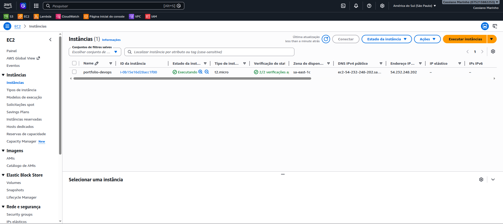
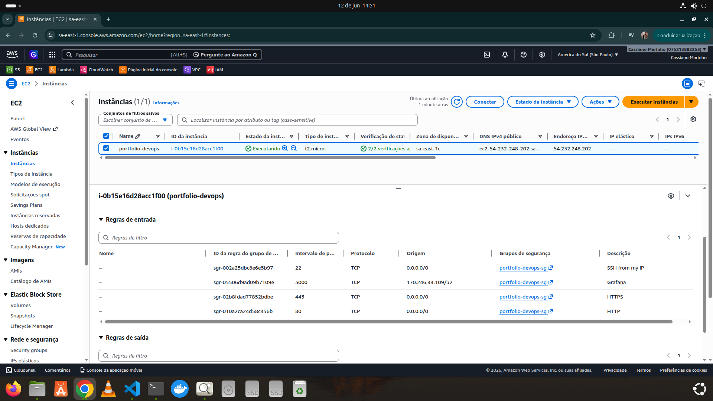
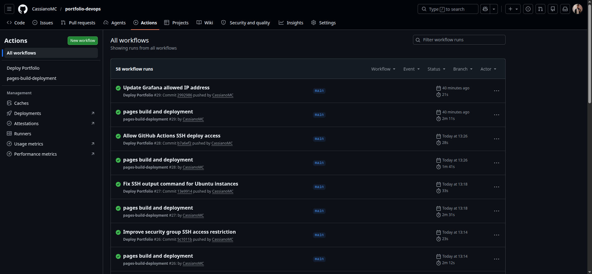
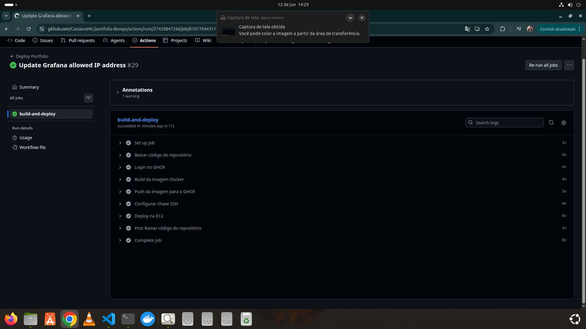
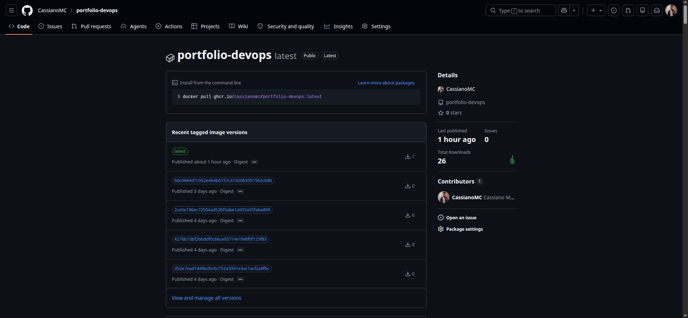
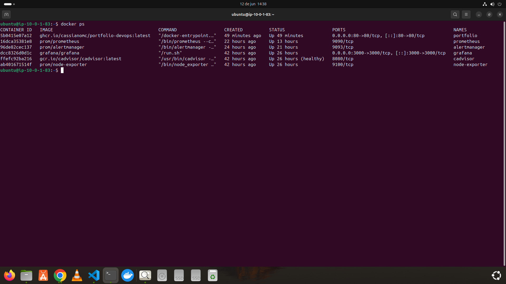
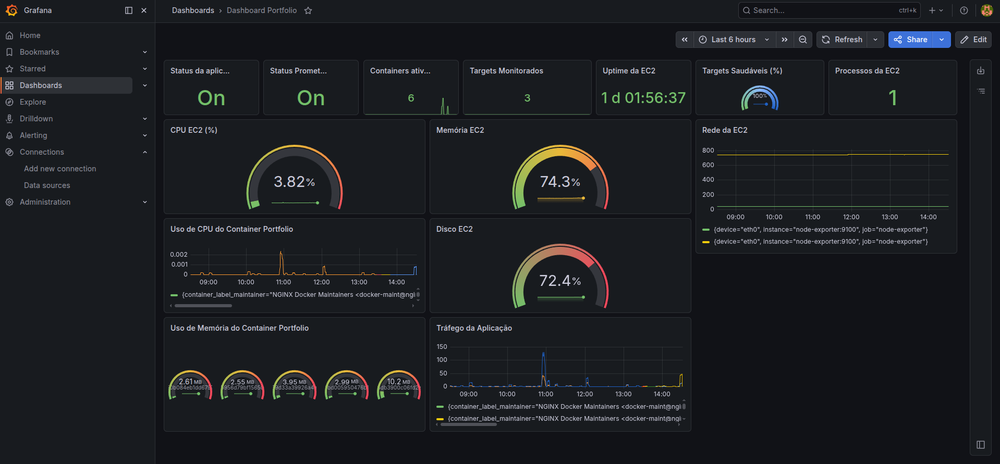
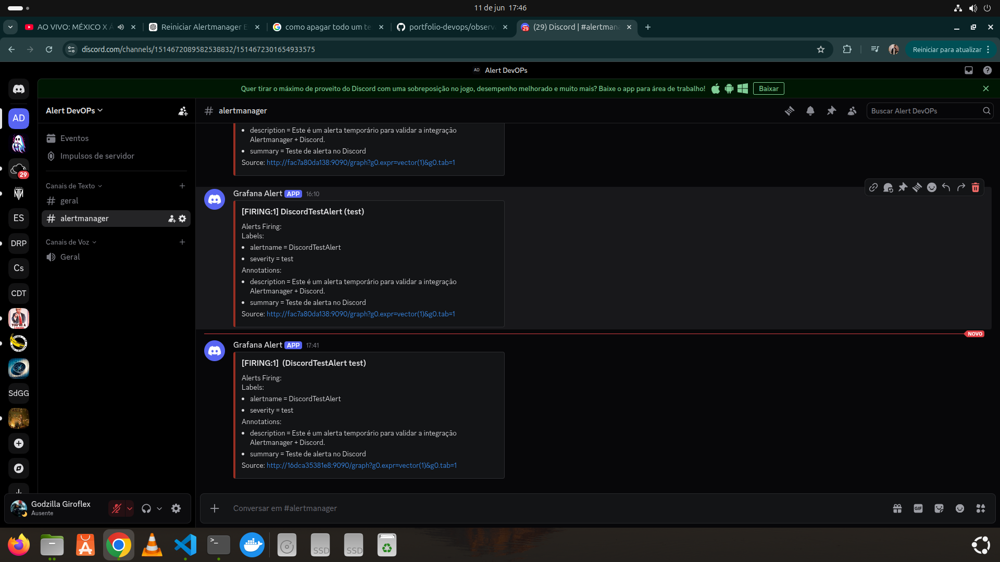

# 🚀 Portfólio DevOps na AWS


Projeto desenvolvido para demonstrar conhecimentos práticos em Cloud Computing, Infraestrutura como Código (IaC), Containerização, CI/CD e Observabilidade utilizando ferramentas amplamente adotadas em ambientes DevOps modernos.

---

# 📋 Sobre o Projeto

Este projeto consiste na criação e publicação de uma aplicação web hospedada em uma infraestrutura provisionada na AWS e totalmente automatizada através de pipelines CI/CD.

O ambiente foi construído utilizando Terraform para provisionamento da infraestrutura, Docker para containerização, GitHub Actions para automação de deploy e uma stack completa de observabilidade composta por Prometheus, Grafana, Alertmanager, Node Exporter e cAdvisor.

Além do monitoramento, o projeto conta com integração entre Alertmanager e Discord para envio automático de alertas em tempo real.

### Conceitos praticados

* Linux
* AWS
* Terraform
* Terraform Remote State (S3)
* Docker
* GitHub Actions
* GitHub Container Registry (GHCR)
* CI/CD
* Observabilidade
* Prometheus
* Grafana
* Alertmanager
* Node Exporter
* cAdvisor
* Discord Webhooks
* Infraestrutura como Código
* Automação de Deploy

---

# 🔗 Links

## 🌐 Aplicação

https://cassianomc.github.io/portfolio-devops/

## 📂 Repositório

https://github.com/cassianomc/portfolio-devops

---

# 🏗️ Arquitetura da Solução

```text
                     Git Push
                         │
                         ▼
┌──────────────────────────────────┐
│             GitHub               │
└───────────────┬──────────────────┘
                │
                ▼
┌──────────────────────────────────┐
│         GitHub Actions           │
│      Build + Deploy Pipeline     │
└───────────────┬──────────────────┘
                │
                ▼
┌──────────────────────────────────┐
│               GHCR               │
│   GitHub Container Registry      │
└───────────────┬──────────────────┘
                │
                ▼
┌─────────────────────────────────────────────┐
│               AWS EC2 Ubuntu                │
│                                             │
│ Docker                                      │
│ ├── Portfolio                               │
│ ├── Prometheus                              │
│ ├── Grafana                                 │
│ ├── Alertmanager                            │
│ ├── Node Exporter                           │
│ └── cAdvisor                                │
└─────────────────────────────────────────────┘
```

---

# 📊 Arquitetura de Observabilidade

```text
Node Exporter ──┐
                │
cAdvisor ───────┼────► Prometheus ─────► Grafana
                │
                │
                └────► Alertmanager ─────► Discord
```

---

# 📸 Evidências do Projeto

As imagens abaixo demonstram o funcionamento real da infraestrutura, pipeline CI/CD, containers e stack de observabilidade implementados no projeto.

## ☁️ Infraestrutura AWS

### Instância EC2 Provisionada via Terraform



### Security Group



---

## 🔄 Pipeline CI/CD

### Execuções do GitHub Actions



### Workflow de Deploy



---

## 📦 GitHub Container Registry

### GHCR



---

## 🐳 Containers em Produção

### Docker



---

## 📊 Dashboard de Observabilidade

### Grafana



---

## 🚨 Sistema de Alertas

### Alertmanager + Discord



---

# 🛠️ Tecnologias Utilizadas

## Cloud

* AWS EC2

## Infraestrutura como Código

* Terraform
* Terraform Backend S3 (Remote State)

## Containerização

* Docker
* Docker Compose

## CI/CD

* GitHub Actions

## Registry

* GitHub Container Registry (GHCR)

## Observabilidade

* Prometheus
* Grafana
* Alertmanager
* Node Exporter
* cAdvisor

## Sistema Operacional

* Ubuntu Linux

## Controle de Versão

* Git
* GitHub

## Desenvolvimento Web

* HTML5
* CSS3

---

# 📁 Estrutura do Projeto

```text
portfolio-devops/
│
├── .github/
│   └── workflows/
│       └── deploy.yml
│
├── app/
│   └── index.html
│
├── docs/
│   ├── index.html
│   └── images/
│
├── infrastructure/
│   └── terraform/
│       ├── main.tf
│       ├── variables.tf
│       ├── outputs.tf
│       └── backend.tf
│
├── observability/
│   ├── docker-compose.yml
│   ├── prometheus.yml
│   ├── alert.rules.yml
│   │
│   └── alertmanager/
│       └── alertmanager.yml
│
├── Dockerfile
├── README.md
└── .gitignore
```

---

# ⚙️ Infraestrutura como Código

Toda a infraestrutura foi provisionada utilizando Terraform.

### Recursos Provisionados

* AWS EC2
* Security Group
* Regras SSH (22)
* Regras HTTP (80)
* Regras HTTPS (443)
* Regras Grafana (3000)
* Key Pair
* Backend Remoto S3

### Comandos Utilizados

```bash
terraform init
terraform validate
terraform plan
terraform apply
```

### Remote State

O estado do Terraform é armazenado remotamente em um bucket Amazon S3, permitindo persistência, segurança e gerenciamento centralizado da infraestrutura.

---

# 🐳 Containerização

A aplicação foi empacotada utilizando Docker e executada em uma instância EC2.

### Serviços Executados

* Aplicação Web
* Prometheus
* Grafana
* Alertmanager
* Node Exporter
* cAdvisor

### Benefícios

* Portabilidade
* Padronização
* Escalabilidade
* Facilidade de Deploy
* Reprodutibilidade

---

# 🔄 Pipeline CI/CD

A cada alteração enviada para a branch principal:

```bash
git add .
git commit -m "Atualização"
git push origin main
```

A pipeline executa automaticamente:

1. Checkout do código
2. Build da imagem Docker
3. Publicação da imagem no GHCR
4. Conexão SSH com a EC2
5. Pull da nova imagem
6. Atualização do container
7. Deploy automático

---

# 📈 Observabilidade

Foi implementada uma stack completa para monitoramento da infraestrutura e containers.

### Prometheus

Responsável pela coleta das métricas da infraestrutura e dos containers.

### Grafana

Responsável pela visualização e análise das métricas coletadas.

### Node Exporter

Responsável pela coleta de métricas do sistema operacional Linux.

### cAdvisor

Responsável pela coleta de métricas dos containers Docker.

### Alertmanager

Responsável pelo gerenciamento e roteamento dos alertas gerados pelo Prometheus.

### Integração Discord

Envio automático de alertas através de Webhooks do Discord.

### Alertas Validados

* Target indisponível
* Alta utilização de memória
* Alta utilização de disco
* Alertas customizados de teste

---

# 🔒 Segurança

Boas práticas aplicadas no projeto:

### Portas Públicas

* 22 (SSH)
* 80 (HTTP)
* 443 (HTTPS)
* 3000 (Grafana)

### Portas Internas

Os serviços de observabilidade permanecem restritos à rede Docker interna:

* 9090 (Prometheus)
* 9093 (Alertmanager)
* 9100 (Node Exporter)
* 8080 (cAdvisor)

---

# 🎓 Habilidades Demonstradas

✅ Linux

✅ AWS EC2

✅ Terraform

✅ Terraform Remote State (S3)

✅ Docker

✅ Docker Compose

✅ Git

✅ GitHub

✅ GitHub Actions

✅ GitHub Container Registry (GHCR)

✅ SSH

✅ Infraestrutura como Código (IaC)

✅ CI/CD

✅ Deploy Automatizado

✅ Cloud Computing

✅ Prometheus

✅ Grafana

✅ Alertmanager

✅ Node Exporter

✅ cAdvisor

✅ Observabilidade

✅ Monitoramento de Infraestrutura

✅ Monitoramento de Containers

✅ Troubleshooting

---

# 🛣️ Roadmap

## Concluído

* [x] Aplicação Web
* [x] Docker
* [x] AWS EC2
* [x] Terraform
* [x] Terraform Remote State (S3)
* [x] GitHub Actions
* [x] GHCR
* [x] Deploy Automático
* [x] Prometheus
* [x] Grafana
* [x] Node Exporter
* [x] cAdvisor
* [x] Alertmanager
* [x] Alertmanager + Discord

## Próximas Evoluções

* [ ] HTTPS com Let's Encrypt
* [ ] Domínio personalizado
* [ ] Dashboard dedicado para containers
* [ ] Loki
* [ ] Centralização de Logs
* [ ] Kubernetes
* [ ] GitOps

---

# 👨‍💻 Autor

## Cassiano Marinho

DevOps | Cloud | Observabilidade | SRE

### Tecnologias

* Linux
* AWS
* Terraform
* Docker
* GitHub Actions
* Prometheus
* Grafana
* Observabilidade

### Atualmente Estudando

* Kubernetes
* GitOps
* Advanced Terraform
* Observabilidade

---

⭐ Este projeto faz parte da minha jornada de evolução profissional na área de DevOps, Cloud Computing, SRE e Observabilidade.
